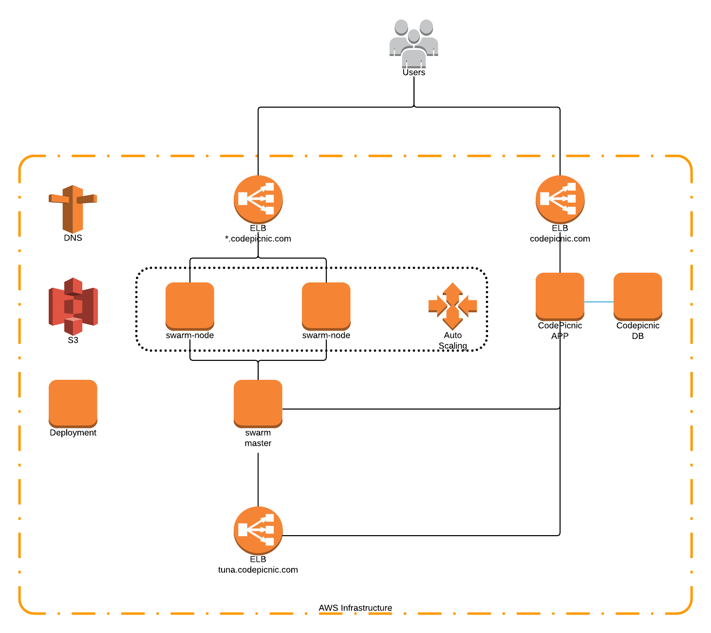
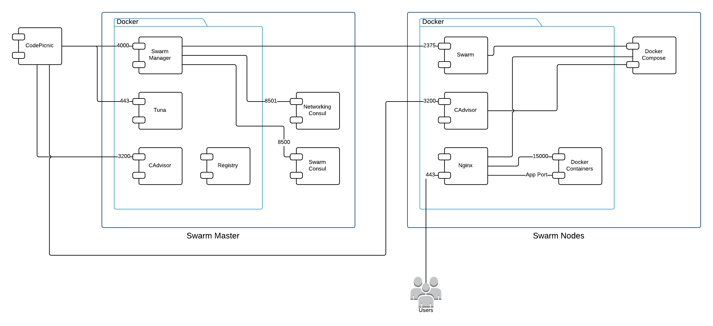

# CodePicnic Architecture Overview

## Cloud Infrastructure

### Components

* ELB *.codepicnic.com (elb-swarm-01)
* ELB codepicnic.com
* ELB tuna.codepicnic.com
* Swarm Nodes
* Swarm Master
* Swarm Autoscaling
* CodePicnic Server
* Deployment Server
* DNS
* S3
* NewRelic

## Docker Swarm Architecture

### Components

* Swarm Manager
* Docker Registry
* Networking Consul
* Swarm Consul
* Swarm Nodes
* CAdvisor
* Swarm Nginx
* Tuna
* Docker Containers
