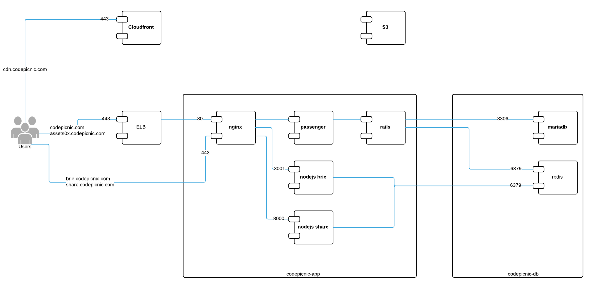

# CodePicnic Architecture Overview

## Cloud Infrastructure

### Components

* ELB *.codepicnic.com (elb-swarm-01)
* ELB codepicnic.com
* ELB tuna.codepicnic.com
* Swarm Nodes
* Swarm Master
* Swarm Autoscaling
* CodePicnic Server
* Deployment Server
* DNS
* S3
* NewRelic

## Docker Swarm Architecture

### Components

* Swarm Manager
* Docker Registry
* Networking Consul
* Swarm Consul
* Swarm Nodes
* CAdvisor
* Swarm Nginx
* Tuna
* Docker Containers

## Codepicnic Architecture

### Components

* ELB codepicnic.com, assets
* Codepicnic APP Server
    - Rails: codepicnic.com (nginx + passenger + rails)
    - Assets: assets01.codepicnic.com, assets02.codepicnic.com, assets03.codepicnic.com (nginx)
    - Nodejs: share.codepicnic.com, brie.codepicnic.com (nginx + nodejs)
* Codepicnic DB Server
    - MariaDB
    - Redis
* Cloudfront cdn.codepicnic.com
* S3 Backups
    - Daily Snapshots: A Jenkins Job launch an AMI backup (no reboot) of all production instances
    - Daily Backups: A scheduled job launch a rails task which uses the backup utility to dump the mariadb and redis databases. The utility also send the dumps to S3.
* Deployment

    Deployment is made through Jenkins (job codepicnic.com) which in turn uses recap/capistrano to deploy the rails application. "ubuntu" is the deployment user, and "codepicnic" is the application user.

